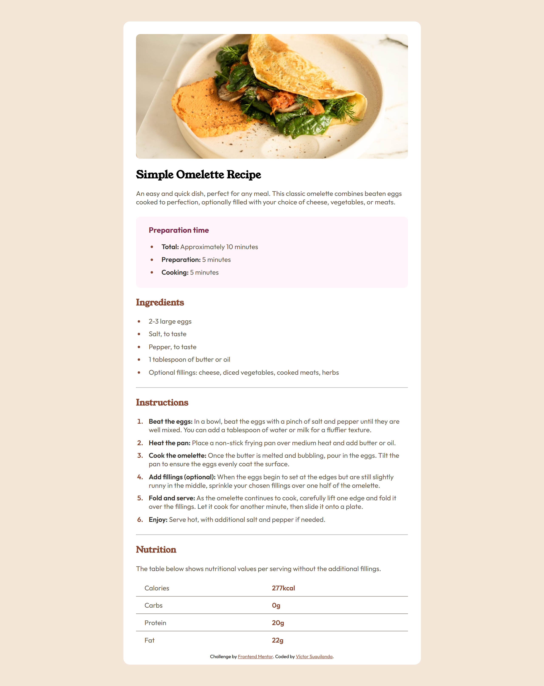

# Frontend Mentor - Recipe page solution

This is my solution to the [Recipe page challenge on Frontend Mentor](https://www.frontendmentor.io/challenges/recipe-page-KiTsR8QQKm). Frontend Mentor challenges help you improve your coding skills by building realistic projects. 

## Table of contents

- [Overview](#overview)
  - [The challenge](#the-challenge)
  - [Screenshot](#screenshot)
  - [Links](#links)
- [My process](#my-process)
  - [Built with](#built-with)
  - [What I learned](#what-i-learned)
  - [Continued development](#continued-development)
  - [Useful resources](#useful-resources)
  - [AI Collaboration](#ai-collaboration)
- [Author](#author)

## Overview

### The challenge

The goal of this challenge was to build a responsive recipe page that matches the provided design as closely as possible using HTML and CSS.

The design includes:

- A hero image
- Structured recipe content
- Preparation, ingredients and instructions sections
- A nutrition table
- Mobile and desktop layouts

This challenge focuses on semantic HTML structure, typography, spacing, and visual accuracy.

### Screenshot

### Links

- Solution URL: [Click here](https://your-solution-url.com)
- Live Site URL: [Click here](https://victor-sc12.github.io/recipe-page-challenge/)

## My process

### Built with

**1. Main solution (official implementation):**

  - Semantic HTML5 markup
  - CSS custom properties
  - Mobile-first workflow
  - CSS Grid (for the nutrition layout)
  - Responsive design using media queries
  - BEM naming methodology

---

**2. Experimental branch:**

  - Sass (SCSS)
  - Nested selectors
  - Modular structure
  - BEM + Sass combination

The Sass implementation is available in the branch: `experiment/sass-approach`. This branch was created as a comparative and experimental approach and is not part of the main solution.

### What I learned

One of the most important takeaways from this project was reinforcing the importance of semantic HTML structure. I structured the layout using elements such as `main`, `article`, `section`, and `header` to ensure clarity and accessibility.

I also practiced:

- Organizing styles using CSS custom properties in `:root`
- Maintaining consistent spacing and typography
- Applying a mobile-first approach before scaling to desktop
- Using CSS Grid for structured tabular data without relying on `<table>` elements
- Implementing BEM for scalable and maintainable class naming

After completing the solution with native CSS, I reimplemented the same design using Sass. This allowed me to compare both approaches directly. While Sass improved modularity and nesting clarity, I noticed that for a project of this size, native CSS was fully sufficient.

This comparison helped me better understand when a preprocessor adds real value and when it may introduce unnecessary complexity.

### Continued development

In future projects, I would like to:

- Refine my CSS architecture for scalability
- Explore more advanced responsive layout strategies
- Continue experimenting with Sass in larger projects where modularization becomes more impactful

### Useful resources

- [SASS Course on YouTube](https://youtube.com/playlist?list=PL4cUxeGkcC9jxJX7vojNVK-o8ubDZEcNb&si=XlmTBjlAIvJz6MBi) - This course helped me clarify some basic concepts of Sass (variables, partials and structure, nesting). It also helped me define task automation for compiling into CSS.

### AI Collaboration

For this project, I used ChatGPT as a learning assistant.

I used it to:

- Reflect on architectural decisions
- Compare CSS vs Sass approaches
- Structure and refine my README
- Validate best practices in semantic HTML and CSS organization

The goal was not to generate solutions automatically, but to reinforce understanding and decision-making.

## Author

- **Name**: Víctor Suquilanda
- **Frontend Mentor** - [@victor-sc12](https://www.frontendmentor.io/profile/victor-sc12)
- **GitHub** - [@victor-sc12](https://github.com/victor-sc12)
